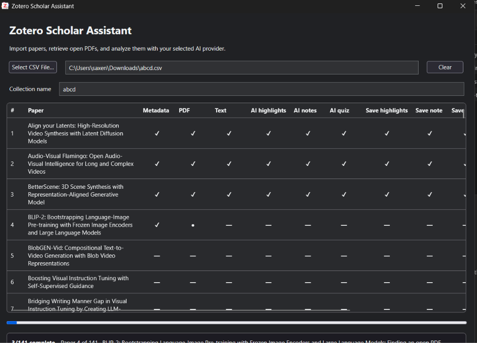

# Zotero Scholar Assistant

[](https://www.zotero.org/)
[](https://nodejs.org/)
[](LICENSE)

Zotero Scholar Assistant is a Zotero 10 add-on for importing lists of research papers, locating open-access PDFs, and producing source-linked highlights, structured study notes, and quizzes with either local Ollama models or Google Gemini.

The add-on is designed for visible, auditable processing. Its dashboard shows every stage for every paper, and incomplete AI output is rejected instead of being saved as broken JSON or an empty quiz.

## Dashboard



The dashboard tracks metadata resolution, PDF retrieval, text extraction, AI generation, and Zotero output creation separately for every paper.

## Features

- Imports one or many papers from CSV, TSV, or semicolon-delimited files.
- Processes a selected Zotero item or PDF attachment directly, without a CSV or a new collection.
- Resolves bibliographic metadata from DOI, arXiv ID, URL, title, authors, and year.
- Searches supported open-access sources for PDFs.
- Extracts indexed PDF text through Zotero.
- Supports local Ollama and Google Gemini.
- Creates Zotero PDF highlight annotations with category colors and explanations.
- Creates a clean, structured study note under each paper.
- Creates a separate quiz note with 5–8 questions, answers, explanations, and difficulty levels.
- Validates generated content and refuses truncated or incomplete JSON.
- Shows live per-paper stages and a stage-based progress bar.
- Adds a Scholar Assistant section to the Zotero item pane with output status and direct links to generated notes.
- Supports Zotero light and dark themes.

## Compatibility

| Component | Supported version |
| --- | --- |
| Zotero | 10.0.x |
| Operating systems | Windows, macOS, and Linux supported by Zotero |
| Node.js for building | 20 or newer |
| Ollama | A currently supported Ollama installation |
| Google provider | Google AI Studio API key and access to `gemini-3.5-flash-lite` |

The packaged add-on manifest currently targets Zotero `10.0` through `10.0.*`.

## Installation

### Install a packaged XPI

1. Download a `.xpi` file from the repository's Releases page when a release is available, or build it locally using the instructions below.
2. In Zotero, open **Tools → Plugins**.
3. Open the gear menu and choose **Install Add-on From File…**.
4. Select the `zotero-scholar-assistant-<version>.xpi` file.
5. Accept the installation and completely restart Zotero.

### Build from source

```powershell
git clone https://github.com/Saxena224pawan/zotero-scholar-assistant.git
cd zotero-scholar-assistant
npm ci
npm run build
```

The XPI is written to `build/`. The build command also runs TypeScript validation and the automated test suite.

### Automated builds and releases

Every push to `main` and every pull request is built and tested by GitHub Actions. The resulting XPI is available as a workflow artifact.

To publish a GitHub Release, update the package and add-on versions, commit the changes, and push a matching tag:

```powershell
git tag v1.3.8
git push origin v1.3.8
```

The release workflow validates the tag, builds and tests the add-on, creates the GitHub Release, attaches the versioned XPI, calculates its SHA-256 hash, and publishes the matching Zotero update entry to `updates.json` on `main`.

## Quick start

1. Open **Tools → Scholar Assistant → Settings…**.
2. Select either **Ollama (local)** or **Google Gemini**.
3. Configure the provider as described below.
4. Click **Test AI connection**. A successful test performs a small real generation request.
5. Choose **Tools → Scholar Assistant → Import Papers…**.
6. Select a CSV or TSV file and confirm the provider, model, and collection name.
7. Keep the dashboard open to watch each paper advance through the pipeline.

Generated study and quiz notes appear as child notes under the bibliographic item. Highlights appear on the attached PDF. The Scholar Assistant item-pane section reports which outputs are available and provides buttons to open the notes.

### Process an item already in Zotero

1. Select exactly one bibliographic item that has a PDF attachment. You may instead select the PDF attachment itself when you want to choose a particular PDF.
2. Choose **Tools → Scholar Assistant → Process Selected Paper…**, or right-click the selection and choose **Scholar Assistant: Process PDF**.
3. Confirm the configured provider and model.
4. Follow the one-paper job in the dashboard.

This route uses the existing attached PDF immediately. It does not read a CSV, search the web for a PDF, change metadata, or create a new collection. The generated highlights are attached to that PDF; the study-note summary and quiz are saved as child notes under its bibliographic item.

## AI provider configuration

### Ollama

Install [Ollama](https://ollama.com/) and pull a model, for example:

```powershell
ollama pull gemma3
ollama list
```

Default settings:

| Setting | Default |
| --- | --- |
| Endpoint | `http://127.0.0.1:11434` |
| Model | `gemma3:latest` |
| Processing | Local |

The endpoint may be entered with or without `http://`; the add-on normalizes it automatically. Larger local models may produce better results but can be substantially slower and require more memory.

### Google Gemini

1. Create an API key in [Google AI Studio](https://aistudio.google.com/apikey).
2. Select **Google Gemini** in Scholar Assistant settings.
3. Enter the key and leave the model as `gemini-3.5-flash-lite` unless your account requires another supported model.
4. Leave **Gemini reasoning** disabled for faster processing, or enable it for more reasoning at increased latency.
5. Click **Test AI connection**.

Google processing is split into three independently validated generation requests:

1. Source-linked highlights
2. Structured study notes
3. Quiz questions

This prevents a long highlight list from consuming the output budget before the quiz is generated.

## CSV format

At least one of `title`, `doi`, `arxiv_id`, or `url` must be present for every row. Supported columns are:

| Column | Required | Description |
| --- | --- | --- |
| `title` | Conditional | Paper title |
| `doi` | Conditional | DOI or DOI URL |
| `arxiv_id` | Conditional | arXiv identifier or arXiv URL |
| `authors` | No | Author names |
| `year` | No | Publication year |
| `url` | Conditional | Paper, landing-page, or direct PDF URL |
| `notes` | No | Import notes |

Example:

```csv
title,doi,arxiv_id,authors,year,url,notes
"Attention Is All You Need","10.48550/arXiv.1706.03762","1706.03762","Vaswani et al.",2017,"https://arxiv.org/abs/1706.03762",""
```

See [`sample-papers.csv`](sample-papers.csv) for a multi-paper example. Quoted commas and comma, tab, or semicolon delimiters are supported.

## Processing pipeline and dashboard

Each paper is processed sequentially. The dashboard displays these stages independently:

| Stage | Work performed |
| --- | --- |
| Metadata | Resolve or create the bibliographic item |
| PDF | Locate and attach an accessible PDF |
| Text | Extract indexed text from the PDF |
| AI highlights | Generate and validate exact source passages |
| AI notes | Generate and validate all study-note sections |
| AI quiz | Generate and validate at least five quiz questions |
| Save highlights | Create Zotero PDF annotations |
| Save note | Create the structured child note |
| Save quiz | Create the quiz child note |

A failed stage is shown explicitly with its error. Later stages remain pending, so it is clear where processing stopped.

PDF discovery has a 10-minute limit per attempt. When the first attempt times out, the dashboard marks the paper as deferred and immediately continues with the next row. After the initial pass, each deferred paper is retried once. A second timeout is recorded as a PDF-stage failure.

## Generated output

### Highlights

The add-on requests 8–15 short passages and assigns categories including problem, contribution, concept, methodology, equation, results, limitation, and conclusion. Each annotation includes an explanation and a category tag.

### Study note

The study note contains:

- Summary
- Key contributions
- Important concepts
- Methodology
- Important results
- Limitations
- Key takeaways

Empty placeholder sections and raw JSON are not saved.

### Quiz

The quiz contains 5–8 substantive questions covering the paper's problem, methods, results, concepts, and limitations. Every question includes an answer, explanation, and difficulty.

## Settings reference

| Setting | Purpose |
| --- | --- |
| Provider | Select local Ollama or Google Gemini |
| Ollama endpoint | Base URL of the Ollama server |
| Ollama model | Installed model name shown by `ollama list` |
| Gemini model | Google model endpoint name |
| Google AI API key | Credential stored in the local Zotero profile |
| Gemini reasoning | Enables slower reasoning mode when supported |
| Output language | Language requested for study notes and quizzes |
| Max output tokens | Output limit; Google section generation applies safe minimums |
| Request timeout | Maximum duration of an AI request |
| Chunk threshold | Threshold used for long local-model inputs |
| PDF sources | Enables or disables supported open-access retrieval methods |

## Privacy and API-key safety

The two providers have different privacy characteristics:

- **Ollama:** extracted paper text is sent only to the configured Ollama endpoint. With the default localhost endpoint, processing remains on the local computer.
- **Google Gemini:** extracted paper text is sent to Google's Gemini API. Review Google's terms and privacy policies before processing sensitive documents.

The Google API key is stored in the user's local Zotero preferences. It is not built into the XPI, source code, sample files, or GitHub Actions configuration. The local preference is not encrypted by this add-on.

Never commit or paste real credentials into this repository. Local `.env` files, credential directories, Zotero profiles, Zotero databases, and storage folders are excluded by `.gitignore`. If a key is exposed, revoke it in Google AI Studio immediately and create a replacement.

## PDF retrieval and limitations

The add-on may contact arXiv, Unpaywall, Semantic Scholar, direct URLs supplied in the CSV, and Zotero metadata services. It retrieves only accessible PDFs and does not use paywall-bypass services.

Zotero does not expose a supported PDF text-coordinate map to add-ons. Scholar Assistant finds the best matching page for each quoted passage and creates a small placeholder annotation rectangle. The annotation remains searchable and navigates to the matched page, but the rectangle may not cover the exact sentence.

Scanned PDFs without an indexed text layer must be OCR-processed before analysis. AI output can contain mistakes and should be verified against the paper.

## Troubleshooting

### Google returns HTTP 404

Use `gemini-3.5-flash-lite` for faster, higher-volume imports. The add-on automatically migrates the retired `gemini-2.5-flash` preference. HTTP 429 means the selected model's quota is exhausted; wait for its quota to reset, choose another available Google model, or enable billing in Google AI Studio.

### Import is slow

Local generation speed depends on model size, CPU/GPU hardware, context length, and output length. Google mode performs separate validated requests for the three output types. The dashboard indicates which stage is currently running.

### No PDF was found

Check the DOI, arXiv ID, and URL. Attach an accessible PDF manually if necessary, ensure Zotero has indexed its text, and retry.

### A note or quiz was not created

Check the dashboard failure message. The add-on intentionally refuses malformed JSON, incomplete study notes, fewer than six usable highlights, or fewer than five quiz questions.

### Dashboard or item panel is empty

Confirm version 1.3.8 or newer is installed and completely restart Zotero after replacing the XPI. Open **Tools → Scholar Assistant → Open Dashboard…**. The dashboard includes a dedicated failure panel showing the CSV row, exact pipeline stage, and complete error. Preflight failures such as exhausted Google quota remain visible in the status strip. Select either the bibliographic item or its PDF attachment to view the Scholar Assistant item-pane section.

## Development

Useful commands:

```powershell
npm ci
npm run typecheck
npm test
npm run build
npm run clean
```

Project structure:

```text
addon/                  Static Zotero manifest, preferences, UI, and locale files
scripts/                Build script
src/llm/                Ollama and Google Gemini clients and schemas
src/pipeline/           Import, PDF, analysis, annotation, note, and quiz pipeline
src/ui/                 Dashboard, settings, and item-pane integration
src/utils/              Preferences and logging helpers
test/                   Node test suite
typings/                Minimal Zotero global type declarations
```

The build copies `addon/`, bundles `src/index.ts` into `content/index.js`, and creates the installable XPI in `build/`.

## Contributing and security

See [CONTRIBUTING.md](CONTRIBUTING.md) for development and pull-request guidance. Report security problems using [SECURITY.md](SECURITY.md), not a public issue.

## License

This project is licensed under the [MIT License](LICENSE).
